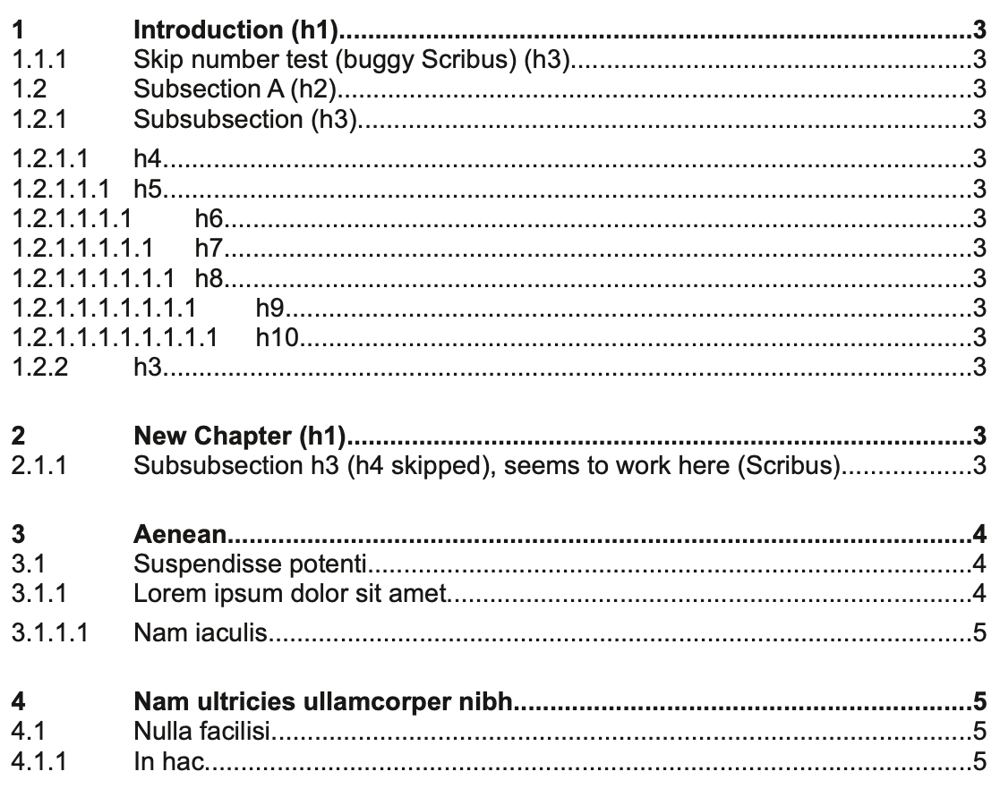

# Table of contents with optional chapter numbering

Generate the table of contents with optional chapter numbering in the current frame by looking at the styles used in the document.




## Example Usage

- 1. Select the text frame you have inserted for the table of contens to show
- 2. Script > Execute Script...
- 3. Choose this script file
- 4. Done. This may take some time, be patient.
- The new styles h1, h2, ... and toc1, toc2, ... will be generated autoamtically. You can and should change them later.
- Edit styles h1, h2, h3, etc. custom styles
- Edit styles toc1, ... custom styles, add 1 or 2 TABs, for chanpter numbering and/or page number at the right.

- See BEGIN and END user config within the script for setup.

## The paragraph styles

By default, the script looks for the styles "h1", "h2", "h3", h4, h5, h6, h7, h8, h9 and h10 styles.
You can add a prefix if you want. I use undeline ("_") for custom created prefixes. "_h1", etc. See script file.

```py
headings = ['h1', 'h2', 'h3', 'h4', 'h5', 'h6', 'h7', 'h8', 'h9', 'h10']
```

Also, by default, the script applies the styles "toc1", "toc2", and "toc3".

```py
toc_styles = ['toc1', 'toc2', 'toc3', 'toc4', 'toc5', 'toc6', 'toc7', 'toc8', 'toc9', 'toc10']
```

If you want to track styles with different names (or add more styles), simply modify the `headings` and `toc_styles` variables (or keep the script as is and read the section below about setting the attributes on the table of contents frame).

## Sections and page numbering

In Scribus you can define sections and

- define the starting page number
- format the page number with different schemas (roman, letters, ...)

You need a Scribus which is newer than 2023-01-24 (1.5.9, 1.6, 1.7) for this script to be able to read the section's page number settings (for older version, you will get sequential values starting from 1).

[An older version of this script](https://github.com/aoloe/scribus-script-repository/tree/03c96173d8142c05437c11f09bf2ea759751de75/table-of-contents) has a `sections` variable that let you define the sections' settings and works with older versions of Scribus.


## Configuration

### Setting the heading and toc styles from the attributes

By adding the attributes `heading_styles` or `toc_styles` to the table of contents frame, you can define custom styles to be used.  

Not only you can customize the name of the styles, but you can create multiple table of contents, by tracking different heading styles.

- In _File > Document Setup > Document Item Attributes_ create the attributes `heading_styles` and / or `toc_styles`, using the type string.
- Select the frame where you want the table of contents and use the context menu to add the `heading_styles` and / or `toc_styles` attribute, setting the value to a comma separated list with the name of the styles.

### Other options

- `toc_new_lines` = None|strip|truncate`
  - `None` (default): the TOC keeps the newline in the title.
  - `'strip'`: the newlines are replaced by spaces.
  - `'truncate'`: remove the part of the heading after the first newline.
