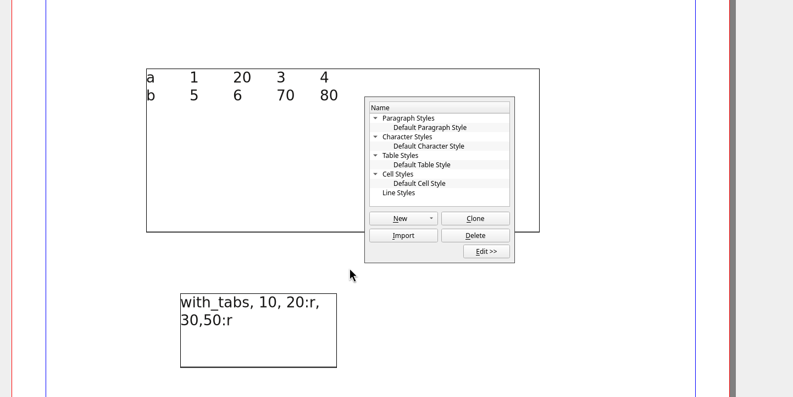

# Define tabs in styles

- Create a non printable text frame where you can set the tabs for the styles, one style per line.
- Each definition is separated by commas, where the the first item is the name of the style.
- If the style does not exist it will be created, otherwise it will be updated.
- The tabs are defined in millimeters
- The position can be followed by a colon and one of:
  - l for a left tab (the default)
  - r for a right tab
  - . for a period tab
  - , for a comma tab
  - c for a centered tab

An example is:

```
with_tabs, 10, 20:r, 40, 100:.
one_right_tab, 40r
```

Will create or update the styles

- _with_tabs_ with four tabs, the second being a right aligned one and the last one being aligned at the dot (for decimal numbers)
- the second style, _one_right_ defines one right aligned tab at 40 mm.


